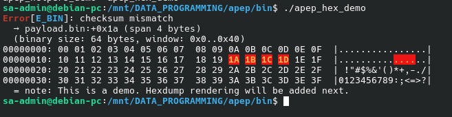
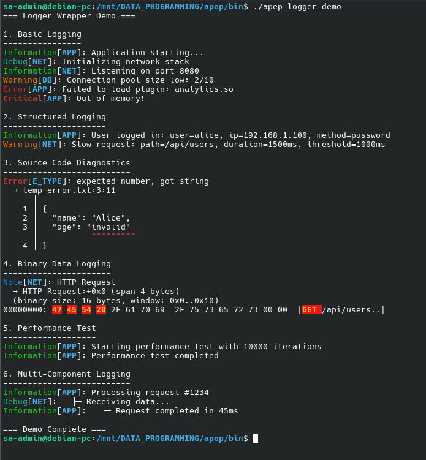

# APEP Quick Start Guide

Get started with APEP in 5 minutes.


## Installation

### Clone and Build

```sh
git clone https://github.com/afrowaveltd/apep.git
cd apep
make
```

Or with CMake:

```sh
mkdir build && cd build
cmake ..
cmake --build .
```

## Basic Usage

### 1. Simple Error Message

```c
#include <apep/apep.h>

int main(void) {
    apep_error("E001", "file not found", "config.txt");
    return 0;
}
```

Output:
```
error[E001]: file not found
```

### 2. Text Diagnostic with Context

```c
#include <apep/apep.h>

int main(void) {
    const char *source = "(1+)";
    
    apep_text_error(
        "E0001",                    // Error code
        "unexpected token ')'",     // Message
        "input.expr",               // File name
        1, 4,                       // Line 1, column 4
        source,                     // Source text
        APEP_SPAN_SINGLE,          // Span type
        1                           // Span length
    );
    
    return 0;
}
```

Output:
```
error[E0001]: unexpected token ')'
  -> input.expr:1:4
      |
    1 | (1+)
      |    ^
```

### 3. Add Notes and Hints

```c
#include <apep/apep.h>

int main(void) {
    const char *source = "(1+)";
    
    apep_text_error(
        "E0001",
        "unexpected token ')'",
        "input.expr",
        1, 4,
        source,
        APEP_SPAN_SINGLE,
        1
    );
    
    apep_note("hint", "expected expression after '+' operator");
    apep_note("help", "remove ')' or add a number after '+'.");
    
    return 0;
}
```

See [docs/API.md](docs/API.md) for complete API documentation.

## Advanced Features

### JSON Output

Export diagnostics in JSON format for programmatic processing:

```c
apep_print_json_diagnostic(stdout, APEP_SEV_ERROR, 
    "E001", "type mismatch", "test.c", 10, 5, 1,
    NULL, 0);
```

### Hexdump Diagnostics



For binary data visualization with highlighted error spans.

### Logger Integration



Use APEP as a logging backend with structured output.

See [docs/LOGGER_INTEGRATION.md](docs/LOGGER_INTEGRATION.md) for more details.

## Localization

```c
#include <apep/apep_i18n.h>

int main(void) {
    // Auto-detect system locale
    apep_i18n_init(NULL, NULL);
    
    apep_error("E001", "file not found", "config.txt");
    
    apep_i18n_cleanup();
    return 0;
}
```

See [docs/I18N.md](docs/I18N.md) for details.

## Next Steps

- **[docs/API.md](docs/API.md)** - Complete API reference
- **[docs/I18N.md](docs/I18N.md)** - Localization guide
- **[DESIGN.md](DESIGN.md)** - Design philosophy
- **[examples/](examples/)** - More code examples