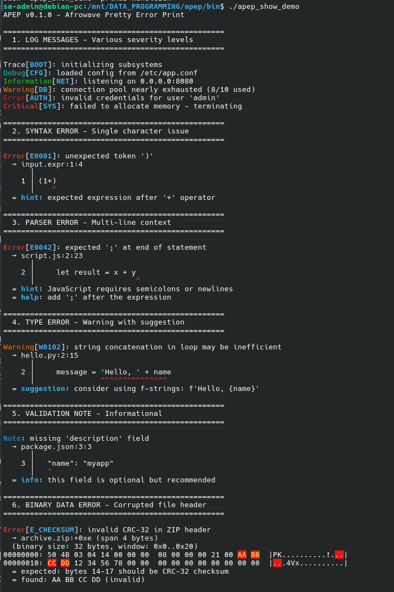
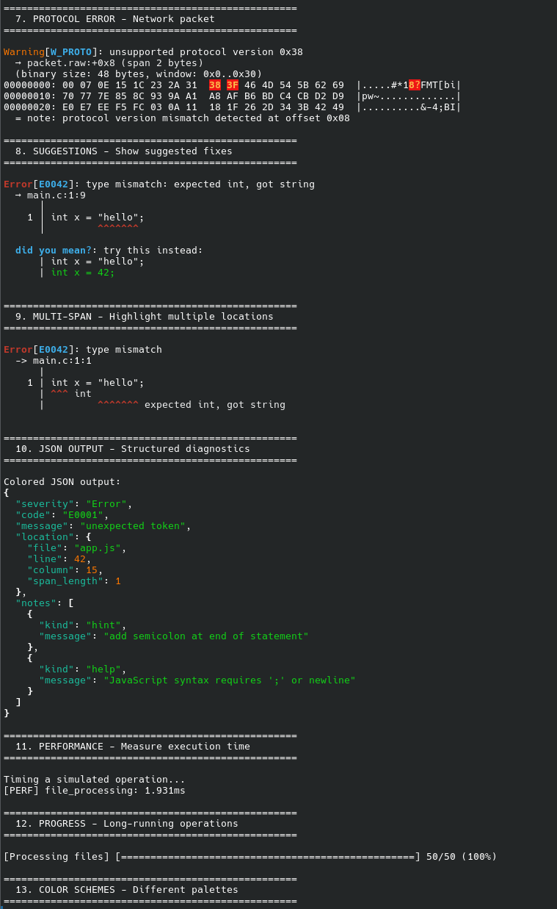
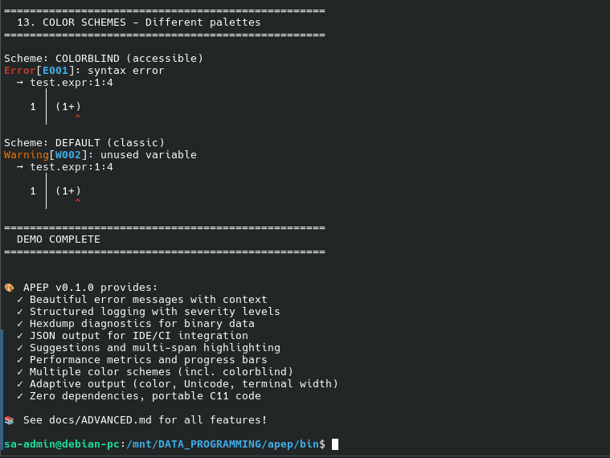
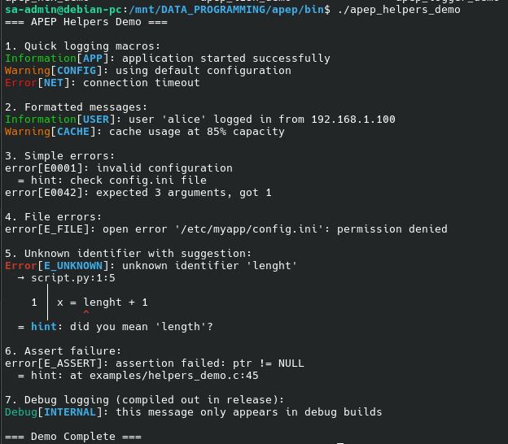

# APEP API Reference





Complete API documentation - version 0.1.0

See full docs at: https://github.com/afrowaveltd/apep

## Core Functions

### apep_print_message

```c
void apep_print_message(const apep_options_t *opt, apep_level_t lvl, 
                        const char *tag, const char *message);
```

Print simple log message. Use NULL for default options.

### apep_print_text_diagnostic

```c
void apep_print_text_diagnostic(const apep_options_t *opt, apep_severity_t sev,
                                const char *code, const char *message,
                                const apep_text_source_t *src, apep_loc_t loc,
                                int span_len_cols, const apep_note_t *notes,
                                size_t notes_count);
```

Print Rust-style text diagnostic with source context.

### apep_print_hex_diagnostic

```c
void apep_print_hex_diagnostic(const apep_options_t *opt, apep_severity_t sev,
                               const char *code, const char *message,
                               const char *blob_name, const uint8_t *data,
                               size_t data_size, apep_span_t span,
                               const apep_note_t *notes, size_t notes_count);
```

Print binary diagnostic with hexdump.

## Helper Functions



See <apep/apep_helpers.h> for:
- apep_error_file() - File operation errors
- apep_error_assert() - Assertion failures  
- apep_error_unknown_identifier() - Unknown ID with suggestion

## Internationalization

See <apep/apep_i18n.h> and [I18N.md](I18N.md) for:
- apep_i18n_init() - Initialize localization
- apep_i18n_get() - Get translated string
- apep_i18n_set_locale() - Switch language

## Configuration

See <apep/apep.h> for apep_options_t structure.

For full API details, see header files in include/apep/